# <div align="center">Coreboot Adaptation<hr>Lenovo Ideapad 320-14ISK<br>[ NM-B241 ]<br>:rabbit2:</div>
[](https://www.gnu.org/licenses/gpl-2.0) 

<br>
This repository holds the information that we find from the reverese enginering process for the board model in the title of this document (`NM-B241`) and the source code you can compile to test it or apply your customs.  Even so you will find pre-compiled files (`.rom` files) that you can use to now flash to the chip, in order to test it.

> [!NOTE]
> This adaptation is based on the Thinkpad Skylake T470s computer.

Also, you find a file called `board_info.txt` that saves the general information of the board for reference.
You can find more information, about the datasheets, schematic, boardview (I recommend to use **FlexBV5** to open the `.tvw` file) and hardware info files, in the open-source provider cloud file repository in this link: [Cloud File Space](https://eli.it.tabdigital.cloud/s/ci6C8onocRfkkLb) 

> You cand find the lastest updates in the new publications of my mastodon social site.

## Specifications
### Target Chip
The chip, that this specific board of the adaptation has, are the `W25Q64JVSIQ` (you should select `W25Q64JV-.Q` if you want to use `flashrom` command). You can find this information and more in the `board_info.txt` file.
This chip support the `PREW` permissions and the **SPI protocol**.

### Board Processor
Core (Inside) i5-6200U Skylake Arch

### OS Used
Arch Linux 2021 edition is used to extract the computer's information.
<br>Booting it with `loglevel=15 selinux=0 iomem=relaxed strict-devmem=0 lockdown=off nopat` :penguin:. Also, this OS edition is **tested with SeaBIOS** and, in results, it boots correctly.

### Flash Program
```bash
flashrom
```
> [!WARNING]
> You need to verify that the firm of the contents of your chip is the same as one of the ROM files I give you. By, first, making copies of the contents of your BIOS-UEFI chip wit `flashrom -p ch341a_spi -c W25Q64JV-.Q -r <BIOS-UEFI_chip_image>`

### Flash Tool
CH341A Pro Kit with SPI chip programer adapter.

### Special Ports
You can find more information of UART, JTAG and LPC ports in [this document](HARDWARE.md).

## BIOS-UEFI ROM Files
You find a directory that save the flat binary files that are in the BIOS-UEFI (has the both boot modes; can emulate the real-mode legacy boot by enabled the proper option in UI menu) chip.

The HAP enabled bit ROM files has the most of the content of the **Intel ME** removed and the **HAP bit set** by `me_cleaner.py` script.


> I recommend you to use UEFI Tool to view the contents of the ROM files chip. To see the structure of regions.

## Reverse Engineering :symbols: :microscope: :shipit:
We reverse engineering the **EC (Embeded Controller)** chip by getting the expected commands in the comunications between the EC chip and the processor (host) chip through **LPC protocol**.

> The tool we used are the logical analyzer `Lakeview Research Saleae` Logic of 8 channels.

**[Still in Process]**


> [!NOTE]
> We based on the ITE configuration siurce code of IT8528E at `src/superio/ite/it8528e/`
<!-- TO DO: Give all detailed information in the directory when the Reversing are completed. -->

## Compilation :hammer_and_wrench: [^3]
If you want to modify the code to configure the boot process as you want. Then this section provide the steps to correctly compile the C code for you to flash in the chip.

**1.** Clone the Coreboot repository.[^2]
```bash
git clone https://review.coreboot.org/coreboot.git
```

**2.** Change the current directory to `coreboot/src/mainboard/lenovo/`.
```bash
cd coreboot/src/mainboard/lenovo/
```

**3.** Make the proper directory.
```bash
mkdir skl_ideapad320-14isk
```

**4.** Change to the created directory.
```
cd skl_ideapad320-14isk/
```

**5.** Clone only the root of this repository.
```bash
git clone --filter=blob:none --sparse https://github.com/Ch3ckm4t3C1ph3r/Lenovo-Ideapad-320-14ISK-_Coreboot-Adaptation_.git
```

**6.** Enter to the root repository clone.
```bash
cd Lenovo-Ideapad-320-14ISK-_Coreboot-Adaptation_/
```

**7.** Clone only the directory `Coreboot Adaptation Code`.
```bash
git sparse-checkout set "Coreboot Adaptation Code"
```

**8.** Change the current directory to the target directory.
```bash
cd Coreboot\ Adaptation\ Code/
```


**9.** Move all the contents of the `Coreboot Adaptation Code` to the mainboard src root directory.
```bash
mv * ../../
```

**10.** Change the current directory to the mainboard src directory.
```bash
cd ../../
```

**11.** Remove the remain repository root, that we don't need to compile.
```bash
rm -rf Lenovo-Ideapad-320-14ISK-_Coreboot-Adaptation_/
```

**12.** Move `grub.cfg`, `unicode.pf2` & `seabios-bootorder.txt` files in the coreboot root.
```bash
mv grub.cfg ../../../../; mv unicode.pf2 ../../../../; mv seabios-bootorder.txt ../../../../
```
> [!NOTE]
> You can specify the relative path in the coreboot menuconfig that bypass the stage 12.

**13.** Change to the Coreboot root directory.[^1]
```bash
cd ../../../../
```

**14.** Compile the configuration of the ROM image, as in the image appears.[^3]


> [!IMPORTANT]
> If you want to make and test the coreboot image, that you can find as `coreboot_ideapad_320_14isk.rom` in this repo, you can follow the `config.log` file contents.

> [!IMPORTANT]
> You need to check `config.log` file in order to view the correct Coreboot configuration.

```bash
make menuconfig
```

**15.** Make the Coreboot ROM image (with blobs included).
```bash
make
```

<!-- TO DO: Give a step-by-step process of compilation of Coreboot targeting the apropiate file for the board in title. -->
## Boot Process Architrecture
Here is a diagram of the boot process using the GRUB as the primary payload an then, either seabios or tianocore, for ilustration of the default CBFS maked to boot steps. In this manner you can select boot in legacy mode or the native mode (UEFI). Saving the capability of select the boot mode of the original propietary BIOS firmware. 

> [!NOTE]
> Unfortunately, the ROM image not only have the Coreboot code because the **Intel ME blob & IFD is necessary** to turn on the RAM memory, not public data available to replace with open-source at RAM stage.

```mermaid
---
config:
  theme: 'base'
  themeVariables:
    edgeLabelBackground: '#B3ADAD'
---
flowchart LR;
    %% Definition of style (and class of style) of each element by id (or by class name)
    style cbfs fill:#f7f7f7,stroke:#000000,stroke-width:1px;
    classDef sbgStyle fill:#F7BB99,stroke:#8F6C59,stroke-width:1px
    classDef nodeStyle fill:#FF5D3B,stroke:#FF3008,stroke-width:1px
    classDef edgeStyle fill:#000000,stroke:#000000,stroke-width:1px
    
        direction LR

        %% Not publicly documented boot process
        subgraph sbg1[First Initialization Process]
          n1[Blobs]
        end

        n1[Blobs] e1@--> n2[Coreboot]

    subgraph cbfs[CBFS]
        subgraph sbg2[Coreboot Process]
          n2[Coreboot]
        end
    
        n2[Coreboot] e2@--> p1{GRUB}
    
        subgraph sbg3[First Payload]
          p1{GRUB}
        end
        
        p1{GRUB} e3@---->|The user selects the second payload from the menu|UNION((*)) e4@--> p2_1[Tianocore] & p2_2[SeaBIOS] & p2_3[coreinfo] & p2_4[Memtest86+]
    
        subgraph sbg4[Second Payload]
          p2_1[Tianocore] & p2_2[SeaBIOS] & p2_3[coreinfo] & p2_4[Memtest86+]
        end
    end

    %% Defining the members of each class
    class sbg1,sbg2,sbg3,sbg4 sbgStyle
    class n1,n2,p1,p2_1,p2_2,p2_3,p2_4,UNION nodeStyle
    class e1,e2,e3 edgeStyle
```




## How to access the UART port :toolbox:
If you want to access the UART port to see real-time events of the board these are the requirements and steps of doing so.

> [!CAUTION]
> Take care in the soldering kit you buy, because you need to apply specific temperature level and get a fine tip to don't burn the around components.

<br><br>Materials:
* Magnetic wires of `0.1mm`.
* Fundent flux.
* UV mask (liquid).
* Welder of intechangable tips (preferable) with a fine tip (needed).
* Debugger probe based on `FT2232H` chips (`FT2232HL`).

> [!NOTE]
> You can enable coreboots logs enabling CONSOLE ROM region logs in coreboot configuration, if you not have soldering skills.

**[Here you will find the instructions to enable the UART protocol; you need soldering skills]**

<!-- TO DO: Give a step-by-step instructions to configure the coreboot program to enable UART protocol. -->

<!-- TO DO: Give problems finded when test the program. -->

## How to add GRUB2 modules correctly?
**1.** Enter to the Coreboot configuration
```bash
make menuconfig
```
**2.** Select `Payload --> Extra modules to include in GRUB image`.<!-- [CB Payload Menu hihglighting this option] -->


**3.** Write the module name.

> [!NOTE]
> To know the available GRUB2 modules, execute the following command. `grep "name =" payloads/external/GRUB2/grub2/grub-core/Makefile.core.def | awk '{print $3}' | tr -d ';' | sort | uniq`

## Personalized modifications
Here you find patches to payloads (secondary & primary).

* [GRUB2 below text modification](https://github.com/Ch3ckm4t3C1ph3r/Lenovo-Ideapad-320-14ISK-_Coreboot-Adaptation_/blob/main/Patchs/grub_menutext_modification.patch)
* [SeaBIOS hide payloads in menu](https://github.com/Ch3ckm4t3C1ph3r/Lenovo-Ideapad-320-14ISK-_Coreboot-Adaptation_/blob/main/Patchs/seabios_hide_payloads.patch)
* [coreinfo menu centralization](https://github.com/Ch3ckm4t3C1ph3r/Lenovo-Ideapad-320-14ISK-_Coreboot-Adaptation_/blob/main/Patchs/coreinfo_centralization.patch)
* [Memtest86+ Change color scheme to BGR](https://github.com/Ch3ckm4t3C1ph3r/Lenovo-Ideapad-320-14ISK-_Coreboot-Adaptation_/blob/main/Patchs/memtest86plus_change_color_to_bgr.patch)
<!-- Patches Links -->

### How to apply this patches?
Copy the `.patch` file in the coreboot root directory and execute this commands.

> [!IMPORTANT]
> You should to be in the root directory of the src payload to apply the patches, correspondingly.

* GRUB2 below text modification
```bash
cd payloads/external/GRUB2/grub2/

git apply grub_menutext_modification.patch
```
* SeaBIOS hide payloads in menu
```bash
cd payloads/external/SeaBIOS/seabios/

git apply seabios_hide_payloads.patch
```

* coreinfo menu centralization
```bash
cd payloads/coreinfo/

git apply coreinfo_centralization.patch
```

* Memtest86+ Change color scheme to BGR
```bash
cd payloads/external/Memtes86Plus/memtest86plus_v6/system

git apply memtest86plus_change_color_to_bgr.patch
```

## References
[^1]: [Coreboot Documentation](https://doc.coreboot.org/index.html).
[^2]: [Coreboot for Developers](https://www.coreboot.org/developers.html).
[^3]: [Coreboot | Starting from Scratch](https://doc.coreboot.org/tutorial/part1.html).
